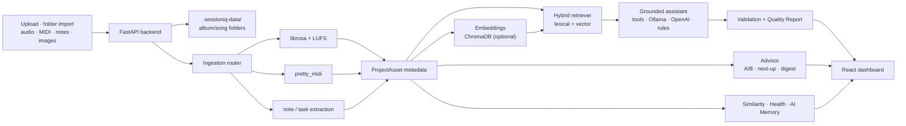

<div align="center">

# 🎛️ SessionIQ

### A source-grounded AI intelligence platform for music production sessions

Upload audio, MIDI, and notes — SessionIQ analyzes them, organizes them into albums and songs,
and answers questions about your work **with citations to the exact files it used.**

[](https://www.python.org/)
[](https://fastapi.tiangolo.com/)
[](https://react.dev/)
[](https://www.typescriptlang.org/)
[](https://tailwindcss.com/)
[](#-testing)
[](https://docs.astral.sh/ruff/)
[](LICENSE)


</div>

---

## Your DAW makes the music. SessionIQ makes the whole operation make sense.

A great track can still disappear into a bad workflow: cryptic filenames, forgotten mix notes,
duplicate bounces, scattered TODOs, mystery tempos, and projects that are *almost finished* for
months. The bigger the catalog gets, the more creative time is lost just reconstructing context.

**SessionIQ turns that production sprawl into a searchable creative control room.** Drop in audio,
MIDI, and notes and it builds a living view of what exists, how it sounds, what still needs work,
and what to do next. Ask a question across one song or an entire catalog and get an answer backed by
the exact source files—not another confident AI guess.

### The problems it solves

| The question that slows a session down | What SessionIQ gives you |
| --- | --- |
| **“Where is the right file?”** | One organized album/song workspace with search, smart collections, tags, statuses, and files that move on disk when projects move. |
| **“What is actually finished?”** | Project Health, completion checks, automatically extracted action items, and progress tracking across every song. |
| **“What do we already have that fits?”** | Meaning-based search plus track similarity across tempo, key, brightness, loudness, and duration. |
| **“What did we decide last time?”** | Notes, a decision log, creative preferences, and a library-wide producer fingerprint that persist between sessions. |
| **“How does my mix compare to the reference?”** | Signed deltas against a reference track — loudness, LUFS, tone, and length — plus a loudness target on every master. |
| **“What should I work on next?”** | A readiness × progress × freshness ranking across every project, and a weekly digest of what stalled, shipped, or needs a decision. |
| **“Can I trust this AI answer?”** | File-level citations and a Quality Report with confidence, grounding, model provenance, latency, token usage, and your own feedback. |
| **“Can I keep sensitive work private?”** | A fully offline baseline with optional local Ollama and local vector search; cloud AI is an upgrade, not a requirement. |

### Built for the people responsible for getting music over the finish line

- **Producers and artists** get less admin, faster session recall, and a clear answer to “what should
  I finish next?”—without interrupting the creative flow to maintain a system by hand.
- **Managers, A&R, and executive producers** get a portfolio-level view of every song, open action,
  reference, master, and readiness signal—without opening every folder or chasing a status update.
- **Engineers and studios** get searchable technical facts, consistent project context, and a faster
  handoff from rough idea to mix-ready or master-ready deliverable.

### One workspace instead of five disconnected tools

SessionIQ can replace much of the day-to-day **glue work** currently split across:

- Finder / File Explorer archaeology and fragile filename conventions
- spreadsheets, Notion pages, or Trello boards used as manual production trackers
- separate BPM/key inspectors and repeated manual audio checks
- scattered text files, task lists, and “I’ll remember that” session notes
- generic AI chats that cannot show which project file supports an answer
- manual catalog audits to find unfinished, missing, related, or release-ready work

It does **not** replace your DAW, audio editor, mastering suite, rights database, or delivery service.
It makes those tools dramatically more useful by becoming the intelligent layer that connects the
files, facts, decisions, and next actions around them.

> **The result:** less time managing the work, less context lost between sessions, and more music
> moving from *promising idea* to *finished release*.

---

## Overview

SessionIQ is **not** a DAW plugin and it does not generate music. It's a smart project notebook and
**LLM-ops-grade AI workflow**: ingestion → analysis → retrieval → a grounded assistant → validation
→ explainability — wrapped in a polished, keyboard-friendly dashboard.

Answers cite project files and include a **Quality Report** with citation checks, numeric checks,
model provenance, latency, and token usage. These checks do not verify every claim or measure
hallucination risk; review the cited evidence for important decisions.

It runs **fully offline** out of the box — a deterministic metadata engine answers when no model is
configured, and semantic search degrades gracefully to lexical when embeddings aren't installed.

## ✨ Highlights

| | |
| --- | --- |
| 🗂️ **Albums & songs** | Nested folder tree — create an album, drop songs inside it, rename (files move on disk), drag files between projects, right-click to delete. |
| 📂 **Folder import** | Point SessionIQ at a folder of bounces — files are copied in, analyzed, and organized; originals stay untouched. |
| 🕵️ **Duplicate detection** | A “Possible Duplicates” smart collection flags same-length, same-tempo bounces before they multiply — a hint, never an auto-delete. |
| 🎚️ **Real analysis** | librosa (BPM, key with major/minor mode, peak/RMS dB, brightness, beats, integrated LUFS) · pretty_midi (notes, pitch range, tempo) · note/task extraction. |
| 🎯 **Delivery checks** | Integrated loudness measured to ITU-R BS.1770-4 and checked against a configurable LUFS target in every project's readiness list. |
| ⏱️ **Time-linked playback** | “Jump to loudest moment” and “play from first beat” seek the bottom player using stored analysis series. |
| 🤖 **Grounded assistant** | Answers cite the files used. It holds a conversation — ask “what about its key?” — and streams live: interpretation, tool calls, and text arrive as they happen. Runs a **local Ollama model**, **OpenAI**, or a deterministic offline engine, automatically. |
| 🔧 **Tool-backed answers** | With an LLM configured, the assistant queries your metadata through tools (filter, aggregate, superlatives, similarity, ranking) so counts and comparisons stay exact — even over 1,000+ files. |
| 📊 **Quality Report** | Per-answer confidence, grounding, provenance (model / prompt version / temperature / latency / tokens / tools used) and automated citation/numeric checks with explicit limitations. |
| 🧠 **AI memory** | A producer “creative fingerprint” derived from your library, editable preferences, and a **decision log** — record what you chose (“locked 96 BPM”) and the assistant quotes it back with citations. |
| 🧾 **Query log & feedback** | Every question is logged with its provenance; thumbs up/down and an “unanswered questions” backlog show where the library needs more (or better) sources. |
| 🔎 **Semantic search & similarity** | Find files by meaning (“tracks that still need mastering”) and compare tracks with a per-dimension breakdown. Tempo folds double/half-time; key compatibility follows the circle of fifths. |
| ⚖️ **Reference A/B** | Mark a track as Reference and every mix gets signed deltas against it — loudness, LUFS, tone, length. |
| 🧭 **Next-up & digest** | Projects ranked by readiness, progress, and freshness — ask “what should I finish next?” in chat, or read the weekly digest of stalled work, ready masters, and new uploads. |
| 🩺 **Project Health** | Completeness score and checklist: audio, notes, reference, master, tasks, and master loudness vs target — with actionable suggestions. |
| 🎤 **Voice memo transcription** | Optional local Whisper turns recordings into notes with extracted tasks. |
| 📄 **Session reports** | One-click Markdown handoff per project (or the whole library): status, readiness, tasks, files, notes, decisions. |
| 🏷️ **Custom tags** | Manual, color-coded tag pills alongside AI-suggested ones. |
| 🎨 **Design** | Token-driven design system (light/dark), tasteful motion, and category color-coding for fast scanning. |

## 🔍 Features in depth

### The assistant

The right rail holds a conversation, not a search box. Follow-ups like *“what about its key?”* are
rewritten into standalone questions before retrieval — a deterministic file-name heuristic handles
most of them for free, and a model call handles the rest when one is configured. Each answer shows
how your follow-up was interpreted, cites the exact files used with the metadata field or note text
behind every claim, and carries a Quality Report you can expand. Any answer can be saved to the
decision log with one click.

With a model configured (Ollama or OpenAI), the assistant can also *act*: it calls metadata tools to
filter, aggregate, rank, and compare before answering, so “how many unfinished tracks are in minor
keys under 100 BPM?” is computed from the real library rather than guessed from truncated text.
Every asset a tool touches becomes a validated, citable source. Without a model, the deterministic
engine answers questions about tempo, key, loudness, tasks, statuses, decisions, and rankings —
fully offline, same citations.

Answers stream over server-sent events: you see the interpretation of your question, each tool call
as it runs, and the answer text as it is written. Every question lands in the query log with its
provenance and your thumbs up/down, building a picture of what the library can and cannot answer
yet.

### Analysis

Every audio file is analyzed for tempo, key (with major/minor mode), peak/RMS dB, integrated
loudness (LUFS, ITU-R BS.1770-4), spectral brightness, and beat positions; MIDI files for notes,
pitch and velocity ranges, instruments, and tempo. Analysis runs at 22.05 kHz mono (the file's true
sample rate is still recorded) — musical features don't need ultrasonics, and this keeps analysis
fast and light on modest hardware.

Each project's readiness checklist compares your master's loudness against a target
(`SESSIONIQ_LUFS_TARGET`, default −14 for streaming) and tells you how far off it is. Any file can
be re-analyzed in place — keeping its status, tags, and notes — and **Upgrade analysis** re-runs the
whole library or one project as a background job with progress, so an existing library picks up
fields from newer analyzers without re-uploading anything.

### Comparing and deciding

The similarity engine compares tracks across tempo, brightness, loudness, length, and key — with
per-dimension breakdowns you can actually reason about. It understands that 90 and 180 BPM can be
the same groove, and that a fifth up or a relative minor is a compatible key, not a mismatch.

Mark a track as **Reference** and every mix in the project is measured against it: signed deltas for
loudness, LUFS, tone, and length, so “my master is 6 dB quieter than the reference” becomes a fact
instead of a feeling. Decisions you record — in Studio or straight from an assistant answer —
persist with the library, are searchable, and can be quoted back with citations. One click exports
a Markdown session report: status, readiness, open tasks, every file's measurements, notes, and
decisions — the handoff document that used to live in a spreadsheet.

### What to finish next

Projects are ranked by a blend of readiness (health checks), task progress, and freshness, with
near-finished-but-stale projects flagged as stalled rather than buried. The ranking appears in
Insights, answers the question in chat, and the weekly digest summarizes what's stalled, what's
ready to ship, what arrived this week, and which projects still lack a reference track.

### Library and files

Uploads are staged and committed as a batch — a failed import leaves nothing behind. The upload
panel also imports a whole folder of bounces (copied, never moved; bounded to 500 files and 512 MB
each). Files live in real album/song folders on disk, move when you rename a project, and deleted
files go to a recoverable trash with a manifest rather than disappearing.

Smart collections cover the usual questions (needs work, needs mastering, ready to export, similar
BPM, same key) plus **Possible Duplicates**. The bottom player persists across views, remembers
where you left off, and can jump to a track's loudest moment or first beat. Note drafts and player
position are kept in the browser; saved notes feed tasks and the assistant.

### Jobs and performance

Long tasks — voice-memo transcription, batch re-analysis — run as background jobs with live
progress and cancellation, so the interface never waits minutes on a single request. Retrieval
caches each file's search text (invalidated on every metadata change) and blends lexical, metadata,
and vector scores with fixed normalized weights, so asking questions stays quick as the library
grows past a thousand files.

## 🖼️ A tour

<table>
<tr>
<td width="50%"><br/><b>Insights</b> — what to finish next, the weekly digest, semantic search, the similarity engine, and the query log.</td>
<td width="50%"><br/><b>Pipeline</b> — a live diagram of the real ingestion → retrieval → generation → validation path, plus the analyzer plugin registry.</td>
</tr>
<tr>
<td width="50%"><br/><b>Studio</b> — AI memory, the decision log, and a git-like session timeline.</td>
<td width="50%" valign="top">

**Four workspaces, one docked assistant**

- **Workspace** — library, file table/grid, inspector, readiness, mix-vs-reference
- **Insights** — next-up ranking, digest, search, similarity, query log
- **Studio** — AI memory, decisions, session timeline
- **Pipeline** — architecture diagram + plugin registry

The right rail has **Assistant / Tasks** tabs, with answer checks under an expandable section.
A persistent bottom player continues across views and remembers the last track and playback position.

</td>
</tr>
</table>

## 🏗️ Architecture



## 🧰 Tech stack

**Backend** — Python 3.11+, FastAPI, Uvicorn, Pydantic, librosa, numpy, soundfile, pretty_midi/mido,
scipy (K-weighted loudness), ChromaDB (optional), faster-whisper (optional), OpenAI SDK (OpenAI **or** Ollama).
**Frontend** — React 19, TypeScript, Vite, Tailwind CSS 4, TanStack Table, Recharts, HTML audio, Framer Motion, Lucide, music-metadata.
**Quality** — Pytest, Ruff, `tsc` + Vite build.

## 🚀 Quick start

**Prerequisites:** Python 3.11+ and Node 22.18+ (Node 24 recommended).

> Paths below use Windows/PowerShell. On macOS/Linux use `.venv/bin/python` instead of `.venv\Scripts\python.exe`.

**1. Backend**

```powershell
python -m venv .venv
.\.venv\Scripts\python.exe -m pip install -e ".[dev]"
.\.venv\Scripts\python.exe scripts\run_api.py       # → http://127.0.0.1:8000
```

**2. Frontend** (in a second terminal)

```powershell
cd web
npm install          # or: pnpm install
npm run dev          # → http://127.0.0.1:5173
```

**3. Load demo content** (optional, recommended)

```powershell
.\.venv\Scripts\python.exe scripts\seed_demo.py     # then restart the API
```

Open **http://127.0.0.1:5173** and you're in. Runtime uploads live under `.sessioniq-data/`
(git-ignored), so nothing you test becomes a repo file.

### Demo content

The repo ships **no audio**. `scripts/seed_demo.py` generates royalty-free demo content entirely in
code — synthesized WAV loops with real, varied BPM, key, and loudness (including a quieter reference
bounce per song so Mix-vs-Reference shows live data), a MIDI progression, mix notes, demo decisions,
and gradient album artwork — organized as an album with songs plus standalone projects. Safe to
showcase and screenshot; re-runnable anytime.

### Optional: smarter AI (never shipped, always local-first)

SessionIQ works offline with a deterministic answer engine. To upgrade:

- **Local LLM (Ollama)** — install [Ollama](https://ollama.com), `ollama pull llama3.2`, then copy
  `.env.example` → `.env` and set `OPENAI_BASE_URL=http://localhost:11434/v1` and `SESSIONIQ_MODEL=llama3.2`.
- **OpenAI** — set `OPENAI_API_KEY` in `.env`.
- **Semantic vector search** — `pip install -e ".[vector]"` for local ChromaDB embeddings.
- **Voice memo transcription** — `pip install -e ".[voice]"` for local Whisper (`SESSIONIQ_WHISPER_MODEL` picks the size).

Run `.\.venv\Scripts\python.exe scripts\check_local_ai.py` to see what's active and get setup hints.
Models and vector indexes download to your machine's cache — they are **never committed**.

## 📁 Project structure

```
sessioniq/
├── src/sessioniq/          # FastAPI backend
│   ├── api.py              # endpoints (library, chat+stream, search, jobs, reports…)
│   ├── ingestion.py        # file → ProjectAsset router
│   ├── audio_analysis.py   # librosa + LUFS analysis (+ WAV fallback)
│   ├── midi_analysis.py    # pretty_midi (+ mido fallback)
│   ├── retrieval.py        # hybrid lexical + ChromaDB vector retriever
│   ├── conversation.py     # follow-up questions → standalone questions
│   ├── tools.py            # metadata query tools for agentic answers
│   ├── assistant.py        # grounded answers + quality metadata (Ollama/OpenAI/rules)
│   ├── validation.py       # citation & grounding checks
│   ├── insights.py         # similarity engine + producer profile
│   ├── advisor.py          # reference A/B, finish-next ranking, weekly digest
│   ├── transcription.py    # optional local Whisper voice-memo transcription
│   ├── jobs.py             # in-process background jobs (progress, cancel)
│   ├── plugins.py          # analyzer registry
│   └── project_workspace.py# projects, smart collections, health, reports, file ops
├── web/src/                # React + TypeScript dashboard
│   ├── App.tsx
│   └── components/         # Sidebar, Chat, Inspector, Insights, Studio, Pipeline, Player…
├── scripts/                # run_api, run_streamlit, seed_demo, check_local_ai
└── tests/                  # pytest suite
```

## 🧪 Testing

```powershell
.\.venv\Scripts\python.exe -m pytest        # 143 passing
.\.venv\Scripts\python.exe -m ruff check .
cd web; npm test                            # frontend scope regressions
npm run build                               # tsc + vite build
```

## 🗄️ Library persistence and recovery

SessionIQ is a single-process local app by design. Writes are serialized within the API process and
the library index is replaced atomically, with the previous version retained as
`library-index.json.bak` in the data directory. Do not point multiple API workers at the same
library — this is not a multi-process database.

Upload folders carry a hash of the project name to prevent slug and case collisions, and existing
file paths stay valid across renames. Deleting an asset moves its file outside the served upload
tree into `trash/<id>/` next to a `manifest.json` recording the original path, asset metadata, and
task statuses — recovery copies are kept until you remove them by hand (there is no trash-management
UI yet, so that space is not reclaimed automatically).

If the process dies at a bad moment, startup recovery relinks assets whose file is missing whenever
exactly one unreferenced file with the same name exists under uploads (the typical interrupted
rename); anything ambiguous keeps its metadata and is flagged with a “File missing” badge. Stale
upload staging directories older than 24 hours are cleaned up at startup. These are heuristics, not
a crash-atomic database: for recovery, stop the API, keep the data directory, and use the manifest
and `.bak` index. Ordinary failed changes roll back in-process automatically.

### Known limits

- One API process per library; running background jobs do not survive a restart (their finished
  effects do).
- Automated answer checks verify citations and numeric claims against sources — they do not measure
  hallucination risk in general.
- Version comparison between bounces and timestamp-linked notes are not implemented yet.

## 📄 License

[MIT](LICENSE) © SessionIQ contributors
