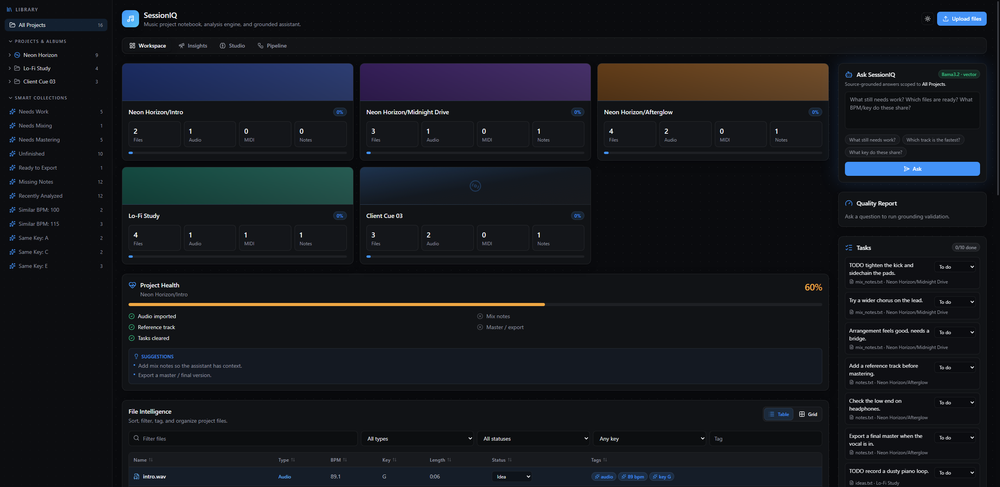
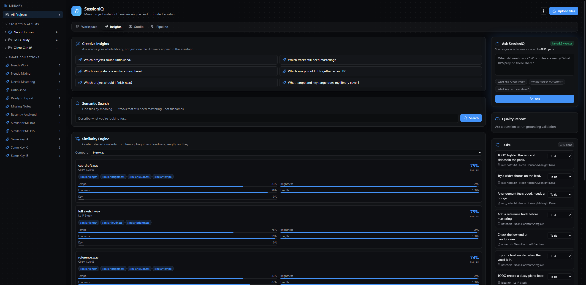
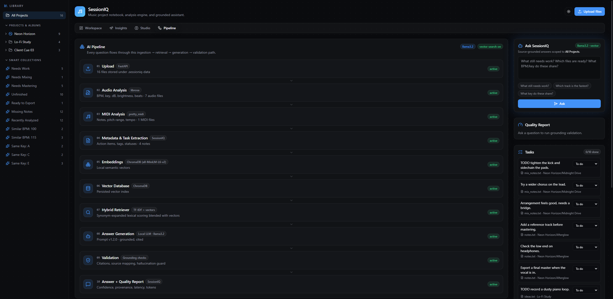
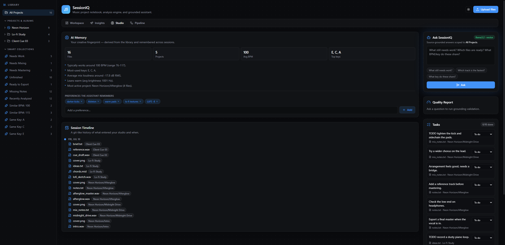
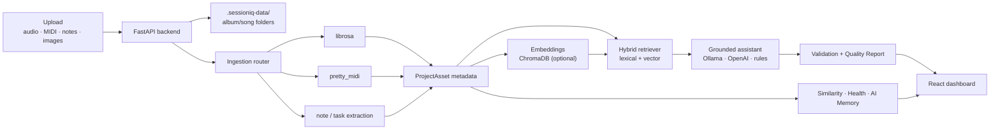

<div align="center">

# 🎛️ SessionIQ

### A source-grounded AI intelligence platform for music production sessions

Upload audio, MIDI, and notes — SessionIQ analyzes them, organizes them into albums and songs,
and answers questions about your work **with citations to the exact files it used.**

[](https://www.python.org/)
[](https://fastapi.tiangolo.com/)
[](https://react.dev/)
[](https://www.typescriptlang.org/)
[](https://tailwindcss.com/)
[](#-testing)
[](https://docs.astral.sh/ruff/)
[](LICENSE)



</div>

---

## Your DAW makes the music. SessionIQ makes the whole operation make sense.

A great track can still disappear into a bad workflow: cryptic filenames, forgotten mix notes,
duplicate bounces, scattered TODOs, mystery tempos, and projects that are *almost finished* for
months. The bigger the catalog gets, the more creative time is lost just reconstructing context.

**SessionIQ turns that production sprawl into a searchable creative control room.** Drop in audio,
MIDI, and notes and it builds a living view of what exists, how it sounds, what still needs work,
and what to do next. Ask a question across one song or an entire catalog and get an answer backed by
the exact source files—not another confident AI guess.

### The problems it solves

| The question that slows a session down | What SessionIQ gives you |
| --- | --- |
| **“Where is the right file?”** | One organized album/song workspace with search, smart collections, tags, statuses, and files that move on disk when projects move. |
| **“What is actually finished?”** | Project Health, completion checks, automatically extracted action items, and progress tracking across every song. |
| **“What do we already have that fits?”** | Meaning-based search plus track similarity across tempo, key, brightness, loudness, and duration. |
| **“What did we decide last time?”** | Notes, session history, creative preferences, and a library-wide producer fingerprint that persist between sessions. |
| **“Can I trust this AI answer?”** | File-level citations and a Quality Report with confidence, grounding, hallucination risk, model provenance, latency, and token usage. |
| **“Can I keep sensitive work private?”** | A fully offline baseline with optional local Ollama and local vector search; cloud AI is an upgrade, not a requirement. |

### Built for the people responsible for getting music over the finish line

- **Producers and artists** get less admin, faster session recall, and a clear answer to “what should
  I finish next?”—without interrupting the creative flow to maintain a system by hand.
- **Managers, A&R, and executive producers** get a portfolio-level view of every song, open action,
  reference, master, and readiness signal—without opening every folder or chasing a status update.
- **Engineers and studios** get searchable technical facts, consistent project context, and a faster
  handoff from rough idea to mix-ready or master-ready deliverable.

### One workspace instead of five disconnected tools

SessionIQ can replace much of the day-to-day **glue work** currently split across:

- Finder / File Explorer archaeology and fragile filename conventions
- spreadsheets, Notion pages, or Trello boards used as manual production trackers
- separate BPM/key inspectors and repeated manual audio checks
- scattered text files, task lists, and “I’ll remember that” session notes
- generic AI chats that cannot show which project file supports an answer
- manual catalog audits to find unfinished, missing, related, or release-ready work

It does **not** replace your DAW, audio editor, mastering suite, rights database, or delivery service.
It makes those tools dramatically more useful by becoming the intelligent layer that connects the
files, facts, decisions, and next actions around them.

> **The result:** less time managing the work, less context lost between sessions, and more music
> moving from *promising idea* to *finished release*.

---

## Overview

SessionIQ is **not** a DAW plugin and it does not generate music. It's a smart project notebook and
**LLM-ops-grade AI workflow**: ingestion → analysis → embeddings → vector retrieval → a grounded
assistant → validation → explainability — wrapped in a polished, keyboard-friendly dashboard.

Every answer the assistant gives is **grounded in your files** and shipped with a **Quality Report**
(confidence, hallucination risk, sources retrieved, model, prompt version, latency, token usage), so
it reads like a real production AI system, not a chat box wired to an LLM.

It runs **fully offline** out of the box — a deterministic metadata engine answers when no model is
configured, and semantic search degrades gracefully to lexical when embeddings aren't installed.

## ✨ Highlights

| | |
| --- | --- |
| 🗂️ **Albums & songs** | Nested folder tree — create an album, drop songs inside it, rename (files move on disk), drag files between projects, right-click to delete. |
| 🎚️ **Real analysis** | librosa (BPM, key, peak/RMS dB, brightness, beats) · pretty_midi (notes, pitch range, tempo) · note/task extraction. |
| 🤖 **Grounded assistant** | Answers cite the files used. Runs a **local Ollama model**, **OpenAI**, or a deterministic offline engine — automatically. |
| 🔎 **Semantic search & similarity** | Find files by meaning ("tracks that still need mastering") and compare tracks — *"Afterglow is 66% similar to Midnight Drive"* — with a per-dimension breakdown. |
| 📊 **Quality Report** | Per-answer confidence, grounding, hallucination risk, provenance (model / prompt version / temperature / latency / tokens) and a 5-point grounding checklist. |
| 🩺 **Project Health** | Completeness score + checklist (audio, notes, reference, master, tasks) + actionable suggestions. |
| 🧠 **AI Memory** | A producer "creative fingerprint" derived from your library plus editable preferences the assistant remembers across sessions. |
| 🏷️ **Custom tags** | Manual, color-coded tag pills alongside AI-suggested ones. |
| 🎨 **Design** | Token-driven design system (light/dark), tasteful motion, and category color-coding for fast scanning. |

## 🖼️ A tour

<table>
<tr>
<td width="50%"><br/><b>Insights</b> — semantic search, the similarity engine, and creative cross-library prompts.</td>
<td width="50%"><br/><b>Pipeline</b> — a live diagram of the real ingestion → retrieval → generation → validation path, plus the analyzer plugin registry.</td>
</tr>
<tr>
<td width="50%"><br/><b>Studio</b> — AI Memory (creative fingerprint) and a git-like session timeline.</td>
<td width="50%" valign="top">

**Four workspaces, one docked assistant**

- **Workspace** — library, project health, file table/grid, inspector
- **Insights** — semantic search, similarity engine, creative insights
- **Studio** — AI memory, session timeline
- **Pipeline** — architecture diagram + plugin registry

The **Ask + Quality Report + Tasks** rail stays docked on the right across every view.

</td>
</tr>
</table>

## 🏗️ Architecture



## 🧰 Tech stack

**Backend** — Python 3.11+, FastAPI, Uvicorn, Pydantic, librosa, numpy, soundfile, pretty_midi/mido, ChromaDB (optional), OpenAI SDK (OpenAI **or** Ollama).
**Frontend** — React 19, TypeScript, Vite, Tailwind CSS 4, TanStack Table, Recharts, wavesurfer.js, Framer Motion, Lucide, music-metadata.
**Quality** — Pytest, Ruff, `tsc` + Vite build.

## 🚀 Quick start

**Prerequisites:** Python 3.11+ and Node 18+.

> Paths below use Windows/PowerShell. On macOS/Linux use `.venv/bin/python` instead of `.venv\Scripts\python.exe`.

**1. Backend**

```powershell
python -m venv .venv
.\.venv\Scripts\python.exe -m pip install -e ".[dev]"
.\.venv\Scripts\python.exe scripts\run_api.py       # → http://127.0.0.1:8000
```

**2. Frontend** (in a second terminal)

```powershell
cd web
npm install          # or: pnpm install
npm run dev          # → http://127.0.0.1:5173
```

**3. Load demo content** (optional, recommended)

```powershell
.\.venv\Scripts\python.exe scripts\seed_demo.py     # then restart the API
```

Open **http://127.0.0.1:5173** and you're in. Runtime uploads live under `.sessioniq-data/`
(git-ignored), so nothing you test becomes a repo file.

### Demo content

The repo ships **no audio**. `scripts/seed_demo.py` generates royalty-free demo content entirely in
code — synthesized WAV loops (with real, varied BPM/key), a MIDI progression, mix notes, and gradient
album artwork — organized as an album with songs plus standalone projects. Safe to showcase and
screenshot; re-runnable anytime.

### Optional: smarter AI (never shipped, always local-first)

SessionIQ works offline with a deterministic answer engine. To upgrade:

- **Local LLM (Ollama)** — install [Ollama](https://ollama.com), `ollama pull llama3.2`, then copy
  `.env.example` → `.env` and set `OPENAI_BASE_URL=http://localhost:11434/v1` and `SESSIONIQ_MODEL=llama3.2`.
- **OpenAI** — set `OPENAI_API_KEY` in `.env`.
- **Semantic vector search** — `pip install -e ".[vector]"` for local ChromaDB embeddings.

Run `.\.venv\Scripts\python.exe scripts\check_local_ai.py` to see what's active and get setup hints.
Models and vector indexes download to your machine's cache — they are **never committed**.

## 📁 Project structure

```
sessioniq/
├── src/sessioniq/          # FastAPI backend
│   ├── api.py              # endpoints (library, chat, search, similar, memory, pipeline…)
│   ├── ingestion.py        # file → ProjectAsset router
│   ├── audio_analysis.py   # librosa analysis (+ WAV fallback)
│   ├── midi_analysis.py    # pretty_midi (+ mido fallback)
│   ├── retrieval.py        # hybrid lexical + ChromaDB vector retriever
│   ├── assistant.py        # grounded answers + quality metadata (Ollama/OpenAI/rules)
│   ├── validation.py       # citation & grounding checks
│   ├── insights.py         # similarity engine + producer profile
│   ├── plugins.py          # analyzer registry
│   └── project_workspace.py# projects, smart collections, health, file ops
├── web/src/                # React + TypeScript dashboard
│   ├── App.tsx
│   └── components/         # Sidebar, Pipeline, Insights, Studio, ContextMenu, ui
├── scripts/                # run_api, run_streamlit, seed_demo, check_local_ai
└── tests/                  # pytest suite
```

## 🧪 Testing

```powershell
.\.venv\Scripts\python.exe -m pytest        # 61 passing
.\.venv\Scripts\python.exe -m ruff check .
cd web; npm run build                       # tsc + vite build
```

## 📄 License

[MIT](LICENSE) © SessionIQ contributors
